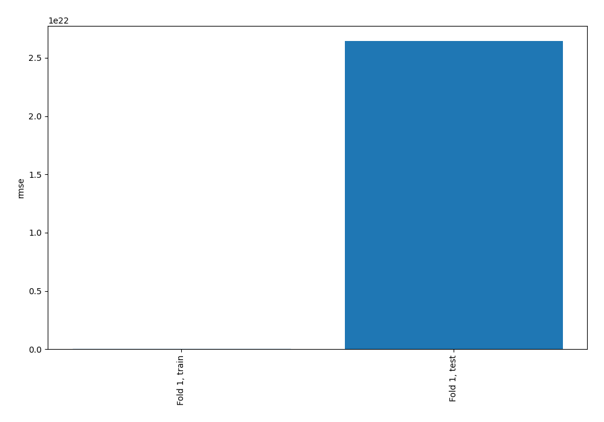
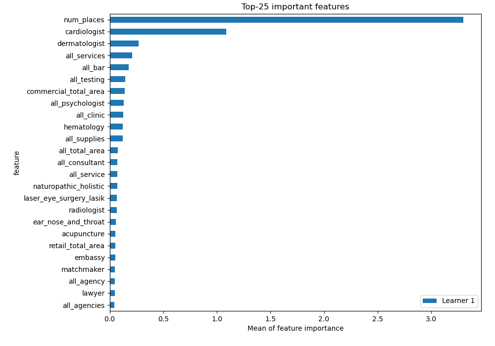
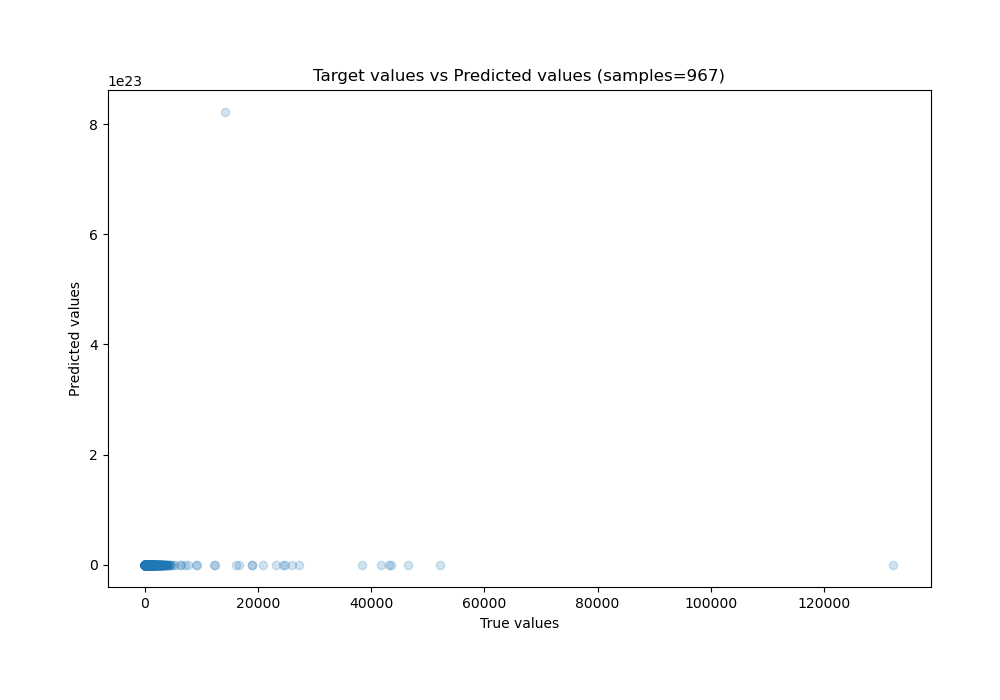
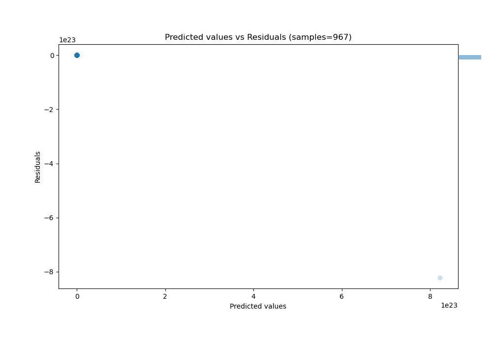

# Summary of 3_Linear

[<< Go back](../README.md)

## Linear Regression (Linear)
- **n_jobs**: -1
- **explain_level**: 2

## Validation
 - **validation_type**: split
 - **train_ratio**: 0.75
 - **shuffle**: True

## Optimized metric
rmse

## Training time

4.5 seconds

### Metric details:
| Metric   |        Score |
|:---------|-------------:|
| MAE      |  8.49572e+20 |
| MSE      |  6.97954e+44 |
| RMSE     |  2.64188e+22 |
| R2       | -1.96653e+37 |
| MAPE     |  6.01041e+16 |

## Learning curves

## Permutation-based Importance

## True vs Predicted

## Predicted vs Residuals

[<< Go back](../README.md)
