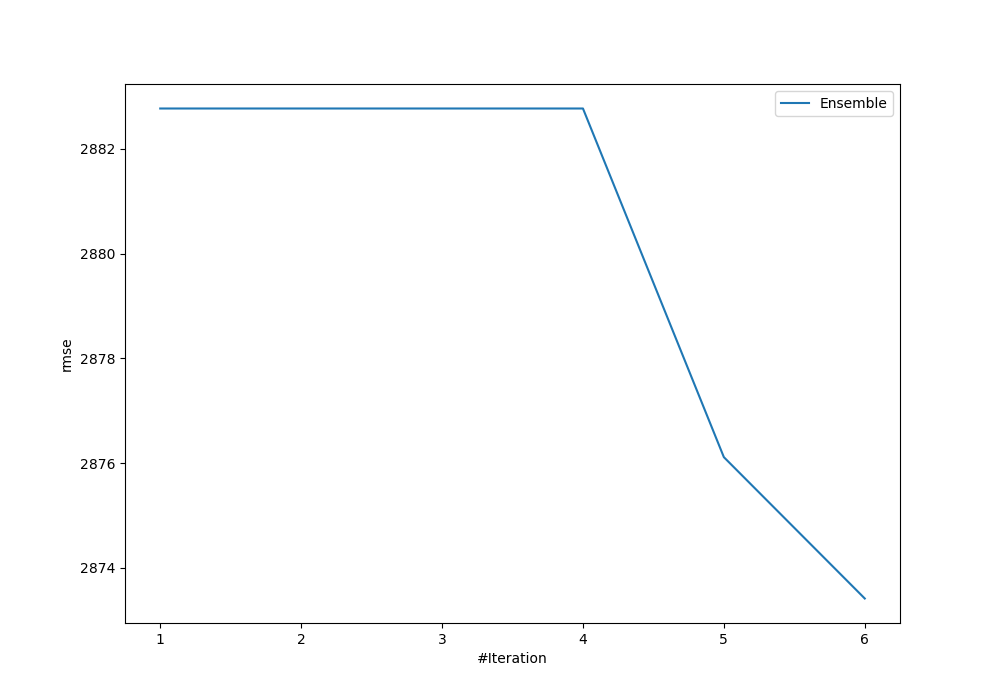
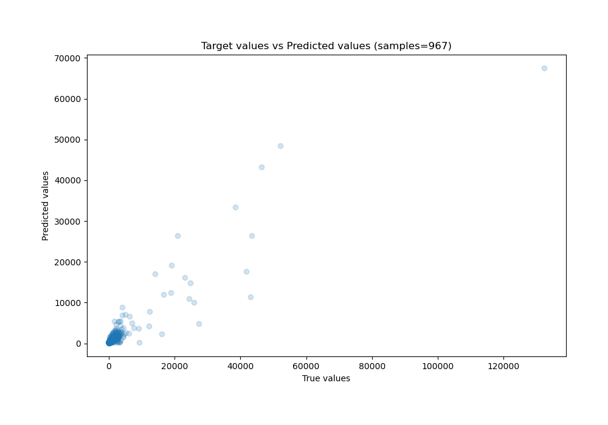
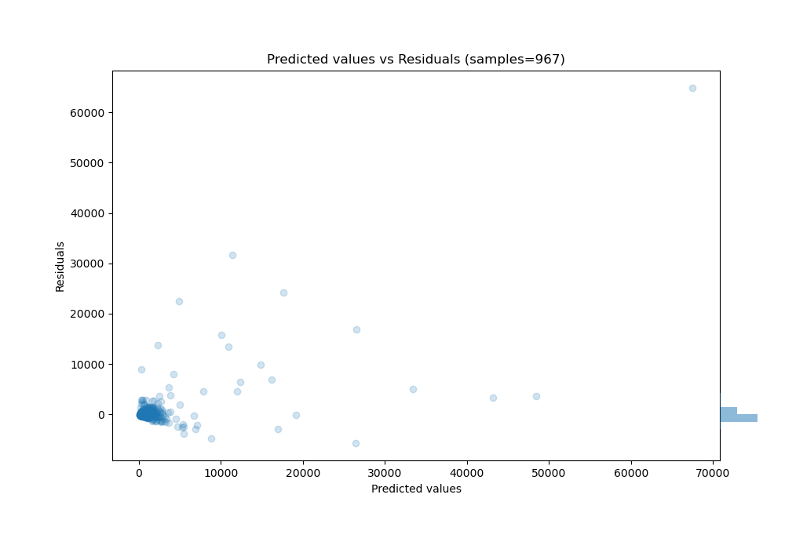

# Summary of Ensemble

[<< Go back](../README.md)

## Ensemble structure
| Model             |   Weight |
|:------------------|---------:|
| 2_DecisionTree    |        1 |
| 4_Default_Xgboost |        5 |

### Metric details:
| Metric   |          Score |
|:---------|---------------:|
| MAE      |  561.06        |
| MSE      |    8.2565e+06  |
| RMSE     | 2873.41        |
| R2       |    0.767368    |
| MAPE     |    2.18614e+15 |

## Learning curves

## True vs Predicted

## Predicted vs Residuals

[<< Go back](../README.md)
