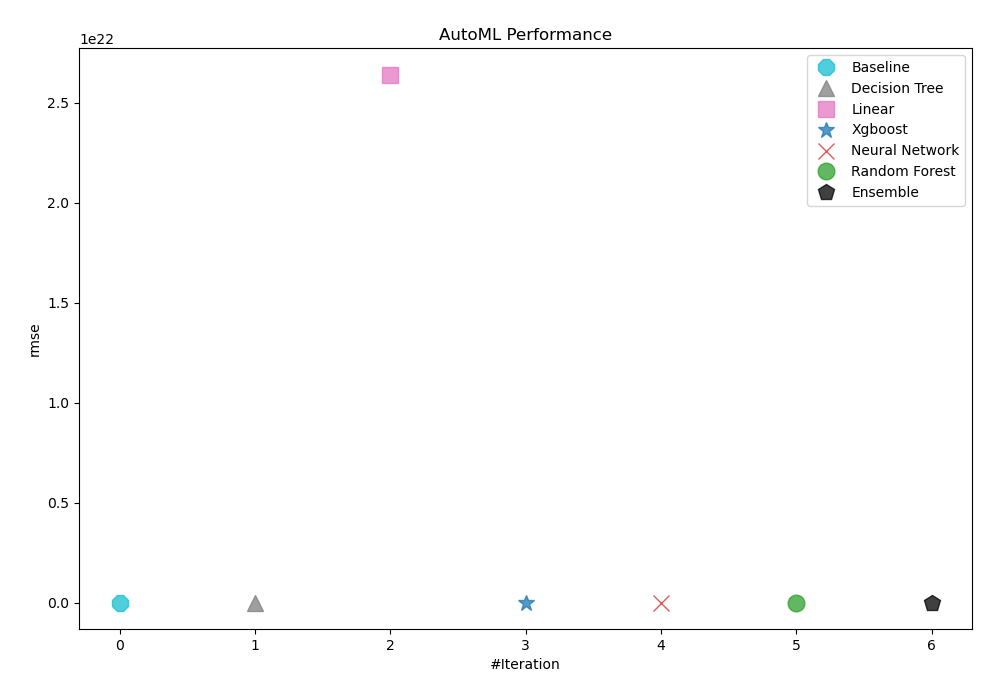
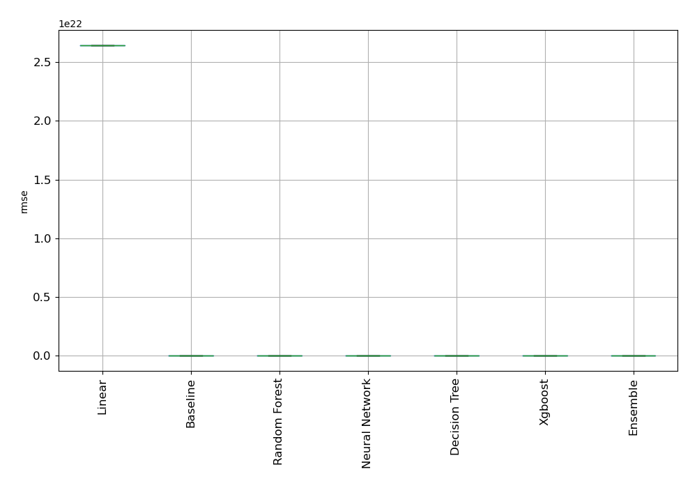
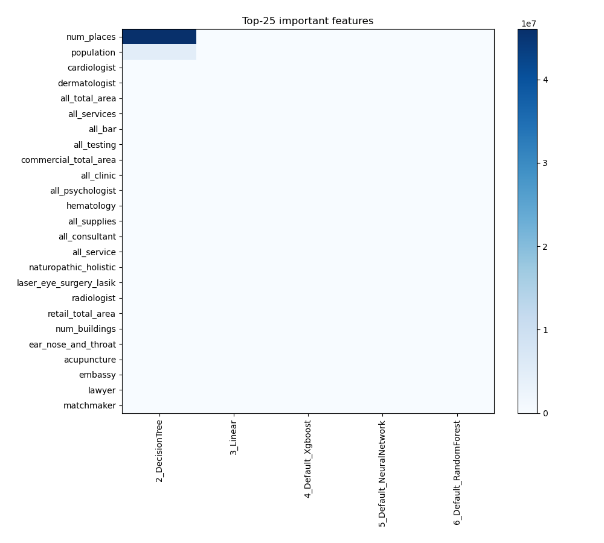
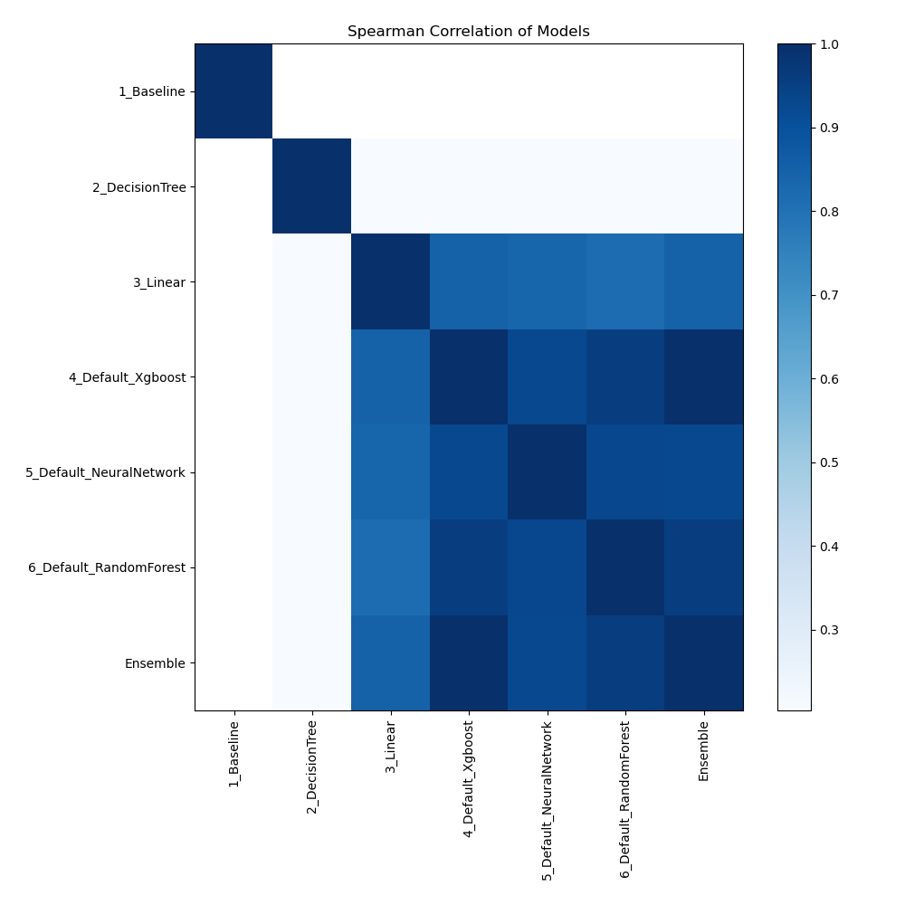

# AutoML Leaderboard

| Best model   | name                                                         | model_type     | metric_type   |   metric_value |   train_time |
|:-------------|:-------------------------------------------------------------|:---------------|:--------------|---------------:|-------------:|
|              | [1_Baseline](1_Baseline/README.md)                           | Baseline       | rmse          | 5958.18        |         0.61 |
|              | [2_DecisionTree](2_DecisionTree/README.md)                   | Decision Tree  | rmse          | 3357.79        |         9.18 |
|              | [3_Linear](3_Linear/README.md)                               | Linear         | rmse          |    2.64188e+22 |         4.72 |
|              | [4_Default_Xgboost](4_Default_Xgboost/README.md)             | Xgboost        | rmse          | 2882.77        |         9.32 |
|              | [5_Default_NeuralNetwork](5_Default_NeuralNetwork/README.md) | Neural Network | rmse          | 4265.52        |         6.03 |
|              | [6_Default_RandomForest](6_Default_RandomForest/README.md)   | Random Forest  | rmse          | 4272.31        |        14.73 |
| **the best** | [Ensemble](Ensemble/README.md)                               | Ensemble       | rmse          | 2873.41        |         0.07 |

### AutoML Performance

### AutoML Performance Boxplot

### Features Importance

### Spearman Correlation of Models

